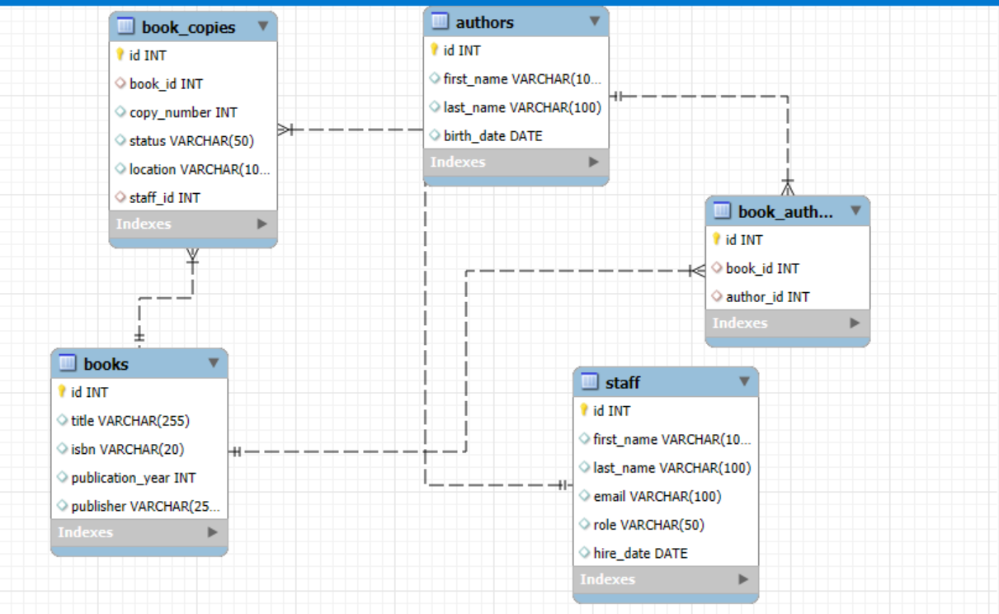

# Week-8-Assignment
# 📚 Library Management System (Core Model with Staff)

This project presents the core **Entity-Relationship Model (ERD)** and database schema for a simplified **Library Management System**. It includes tables for books, book copies, authors, book-author relationships, and staff members.

## 🔍 Project Description

This system allows a library to:

- Catalog books and their metadata
- Track multiple physical copies of books
- Associate books with multiple authors
- Maintain a staff directory with roles and hire dates

## 🛠️ How to Set Up

To run or import the project into your database:

1. Clone or download this repo.
2. Open your SQL database (MySQL/PostgreSQL).
3. Run the SQL file

